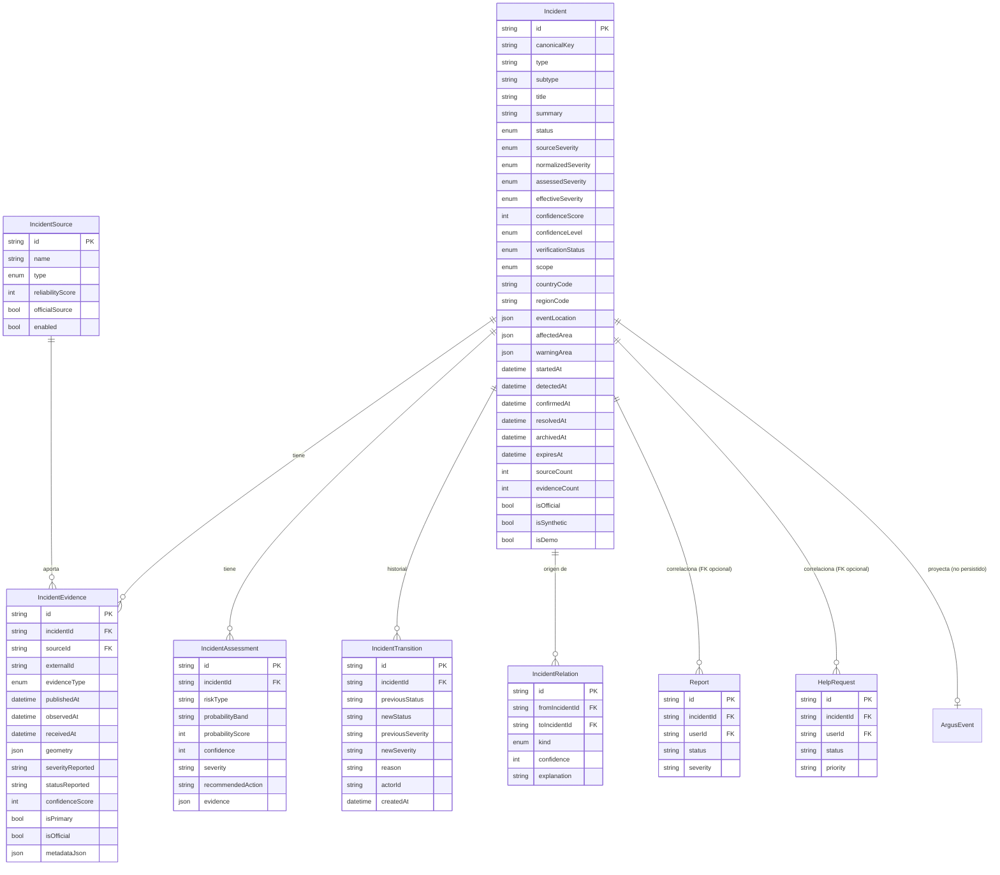
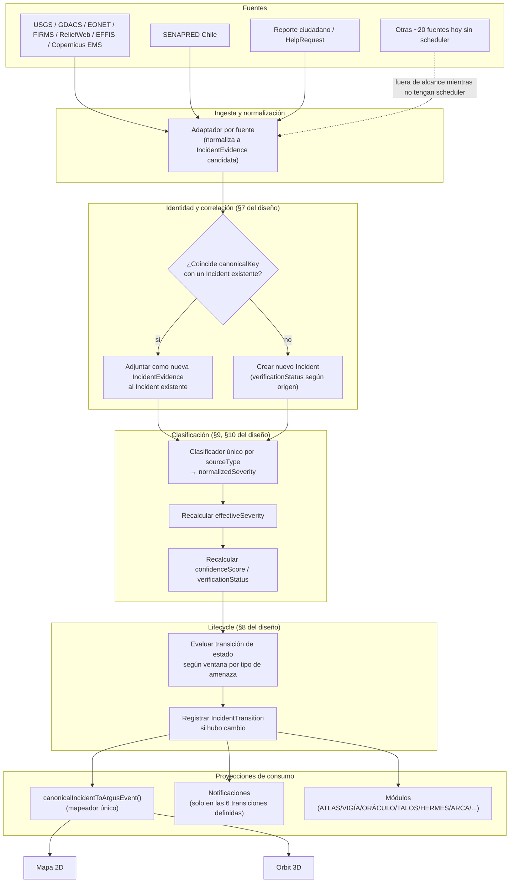
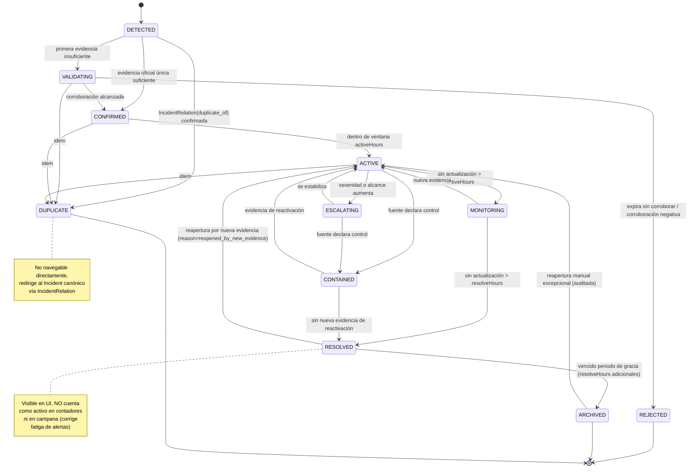
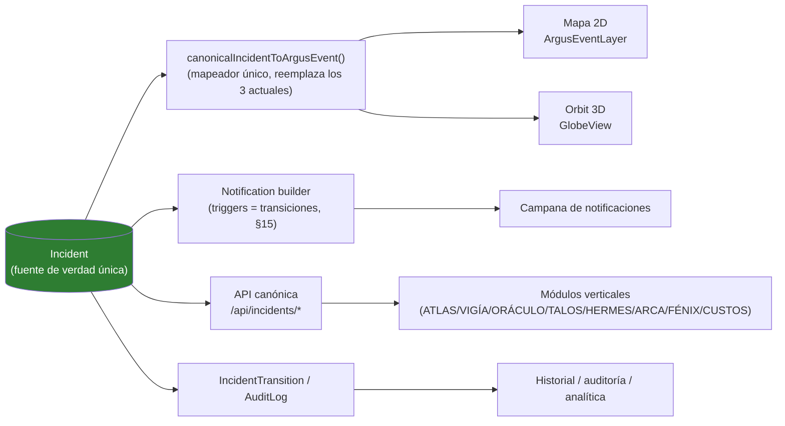
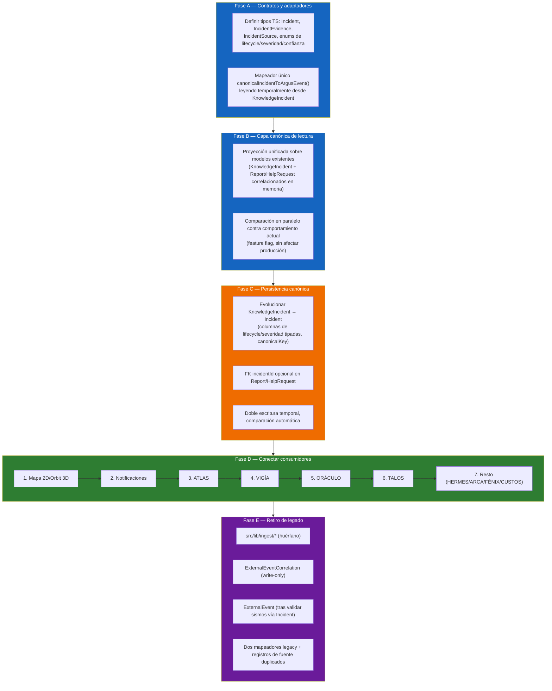

# ARGUS — Diagramas de la Entidad Canónica de Incidente

**Fecha**: 2026-07-14
**Documento hermano de**: `ARGUS_CANONICAL_INCIDENT_DESIGN.md` (decisiones y justificación), `ARGUS_INCIDENT_MIGRATION_PLAN.md` (fases), `ARGUS_INCIDENT_FIELD_MAPPING.md` (matriz de campos).
**Tipo**: solo diagramas — no implementar.

---

## 1. Modelo conceptual (entidad-relación)

**Nota de lectura**: `ArgusEvent` no tiene tabla — se representa como proyección de solo lectura para dejar explícito que ningún consumidor debe tratarlo como fuente de escritura.

---

## 2. Flujo de ingesta objetivo (end-to-end)

---

## 3. Lifecycle canónico (máquina de estados)

---

## 4. Proyecciones de consumo (una fuente, múltiples lecturas)

**Lectura**: todas las proyecciones leen del mismo `Incident`; ninguna escribe de vuelta salvo a través de las operaciones formales (`IncidentTransition`, nueva `IncidentEvidence`). Esto es lo que elimina la posibilidad estructural de que dos proyecciones diverjan como ocurre hoy entre `vigiaIncidentToArgusEvent` y `knowledgeIncidentToArgusEvent`.

---

## 5. Migración — vista de fases (resumen visual; detalle en `ARGUS_INCIDENT_MIGRATION_PLAN.md`)

