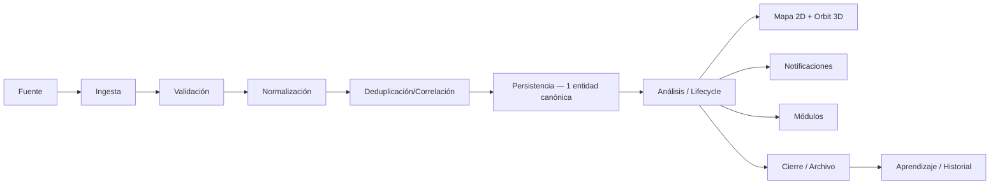
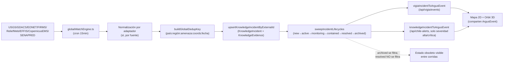
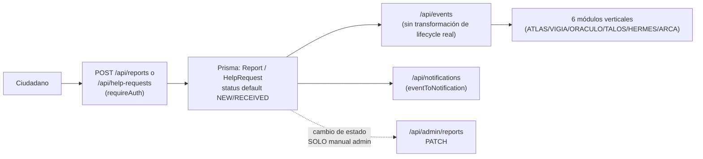
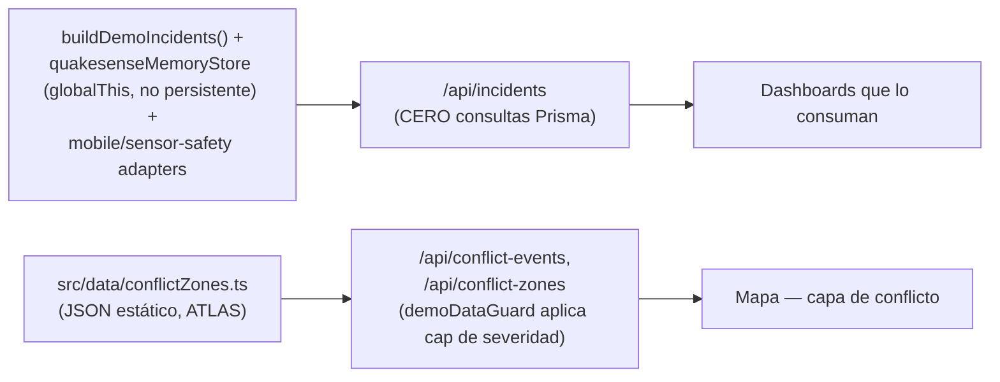
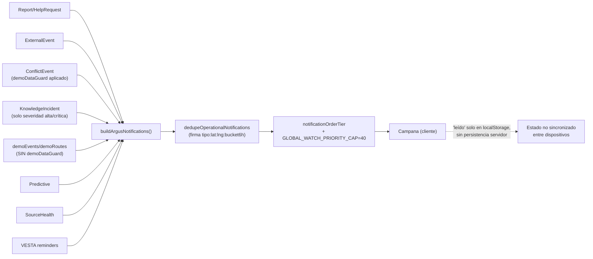

# ARGUS — Flujo de Datos: Actual vs Objetivo

> Ciclo objetivo: **Fuente → ingesta → validación → normalización → deduplicación → persistencia → análisis → mapa → notificación → módulo → cierre.** Este documento contrasta ese ciclo con lo verificado en código el 2026-07-13.

## 1. Flujo objetivo (referencia)

## 2. Flujo real — Global Watch (el único pipeline programado)

**Diferencias clave con el objetivo**:
- La validación es implícita (por forma de adaptador), no un paso explícito y auditable.
- La deduplicación real solo cubre el bucket geo-temporal genérico — sin bucket específico para incendios, y con ventana más estrecha que el motor de correlación legado para sismos.
- El "cierre" existe (`archived`) pero solo se recalcula en cada sweep de cron; entre corridas, un incidente `resolved` sigue apareciendo como si estuviera activo (`/api/vigia/events` solo filtra `archived`).
- **Dos mapeadores independientes** (`vigiaIncidentToArgusEvent` vs `knowledgeIncidentToArgusEvent`) traducen la misma tabla `KnowledgeIncident` con reglas de severidad ligeramente distintas — un parche reciente (canonicalización de severidad verde GDACS, v1.0.3.2) se aplicó solo a uno de los dos.
- No hay paso de "aprendizaje/historial" more allá de `KnowledgeLesson`/`KnowledgeEmbeddingRecord`, que no están conectados de vuelta a la reclasificación automática de futuros eventos (requiere prueba en ejecución).

## 3. Flujo real — Reportes ciudadanos (Report/HelpRequest)

**Diferencia clave**: este flujo **nunca toca `KnowledgeIncident`/`ArgusEvent`**. Es un universo de datos completamente paralelo al de Global Watch — comparten únicamente la campana de notificaciones como punto de encuentro, y ahí llegan sin una taxonomía compartida de severidad/lifecycle.

## 4. Flujo real — "Command Center" (`/api/incidents`) e islas sintéticas

Este flujo **no pasa por ningún paso del ciclo objetivo** salvo la presentación final. No hay ingesta real, no hay deduplicación, no hay persistencia — es contenido fijo o en memoria volátil (se pierde en cada reinicio de proceso).

## 5. Flujo real — Notificaciones (punto de convergencia parcial)

**Diferencia clave**: es el único punto donde 8 fuentes heterogéneas convergen, pero:
- El campo de categoría (`official`/`argus_analysis`/`candidate`) se calcula server-side y **nunca se serializa al cliente** — la UI no puede distinguir visualmente una predicción de un evento confirmado.
- `demoEvents`/`demoRoutes` entran sin pasar por `demoDataGuard`/`isDemoDataAllowed()` — mitigado hoy solo porque la palabra "demo" aparece en `sourceName` y activa el guard de forma incidental en `finalize()`.
- El contador de "críticas" del ícono de campana no excluye incidentes `RESOLVED`/`DISMISSED` — fatiga de alertas confirmada.

## 6. Brechas del ciclo operacional completo (Detectar → validar → correlacionar → clasificar → localizar → evaluar impacto → recomendar → notificar → seguir → cerrar → aprender)

| Etapa | Cobertura real | Evidencia / brecha |
|---|---|---|
| Detectar | Fuerte para el subconjunto de fuentes en Global Watch; débil para ~20 adaptadores sin scheduler | `ARGUS_SOURCE_MATRIX.md` |
| Validar | Implícita por forma de adaptador, no explícita/auditable | Sin paso de validación independiente encontrado |
| Correlacionar | Parcial — bucket genérico funciona, sin bucket wildfire, sin correlación USGS↔GDACS en el pipeline vigente | `dedup.ts`, `correlateExternalEvents.ts` (legado, no en cron) |
| Clasificar | Fragmentada — 10+ tipos de severidad, 3 clasificadores independientes | `ARGUS_TECHNICAL_DEBT.md` |
| Localizar | Bueno para Chile (geometría real ADM1); el adaptador SENAPRED en vivo no la usa por defecto | `ARGUS_SYSTEM_MAP.md` §11, hallazgo P0 de mapa |
| Evaluar impacto | Solo en el silo aislado `RiskAssessment`, no conectado al resto | `ARGUS_MASTER_AUDIT.md` |
| Recomendar | Ausente en la mayoría de tarjetas/paneles (ver spot-check UX) | `ARGUS_TECHNICAL_DEBT.md` |
| Notificar | Funcional pero sin diferenciación de tipo visible al cliente | Arriba §5 |
| Seguir | Sin expiración (`expiresAt` muerto en `ExternalEvent`); lifecycle solo se recalcula por cron | Arriba §2 |
| Cerrar | Existe `archived`, pero `resolved` no se filtra en lectura | Arriba §2 |
| Aprender | `KnowledgeLesson`/`KnowledgeEmbeddingRecord` existen pero su reutilización automática no está confirmada | Requiere prueba en ejecución |

## 7. Conclusión de esta fase

El ciclo operacional completo **existe de forma completa solo dentro del pipeline Global Watch**, y ahí mismo tiene brechas (expiración, doble mapeador, dedup de incendios). Fuera de ese pipeline, los flujos de Reportes ciudadanos, Command Center y ATLAS-conflictos son universos de datos separados que convergen únicamente —y de forma incompleta— en la campana de notificaciones. No existe hoy una "única realidad operacional" tal como exige el principio 2.2 del mandato.
