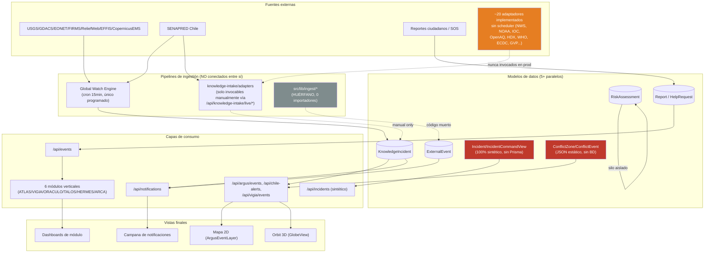

# ARGUS — Mapa de Sistema (Arquitectura Real)

> Documenta la arquitectura tal como fue verificada en código el 2026-07-13, no la arquitectura documentada previamente. Ver `ARGUS_SOURCE_MATRIX.md`, `ARGUS_ENDPOINT_MATRIX.md`, `ARGUS_MODULE_MATRIX.md` para el detalle de evidencia por área.

## 1. Vista general

ARGUS (Next.js 16 + TypeScript + Prisma/PostgreSQL en Supabase, desplegado en Vercel vía CLI manual) no es un sistema único y coherente, sino **varios subsistemas construidos en momentos distintos que coexisten sin una capa de unificación**. El hallazgo estructural más importante de toda la auditoría es este:

**Lectura del diagrama**: el mapa 2D y Orbit 3D SÍ comparten una única fuente (`ArgusEvent`, ver §4) — ese es un punto positivo confirmado. Pero los 6 módulos verticales con datos reales leen exclusivamente `/api/events` (Report/HelpRequest), nunca `ArgusEvent`; y existen al menos dos subsistemas completamente sintéticos (`/api/incidents`, ATLAS conflictos) que no tocan la base de datos en absoluto.

## 2. Frontend

- **Next.js App Router** (`src/app`), ~90 carpetas de rutas API bajo `src/app/api`, páginas de módulos bajo `src/app/modules/*` y `src/app/dashboard/*`.
- **Mapa**: `src/components/map/OperationalMap.tsx` (orquestador), `ArgusEventLayer.tsx` (2D), `GlobeView.tsx` (3D, three.js), `PoiLayer.tsx`. Librerías: `maplibre-gl`, `leaflet`, `three`.
- **Módulos**: `src/modules/<name>/components/*Dashboard.tsx`, cada uno con su propio patrón de tarjetas (`*Card.tsx`, `*KpiGrid.tsx`) sin componente base compartido (ver `ARGUS_TECHNICAL_DEBT.md`).
- **Notificaciones**: `src/components/notifications/NotificationCenterPanel.tsx` + `NotificationItem.tsx`.

## 3. Backend / API

~90 carpetas bajo `src/app/api`. Ver `ARGUS_ENDPOINT_MATRIX.md` para el detalle completo de autenticación. Resumen arquitectónico: **no existe middleware centralizado** — cada `route.ts` implementa (o no) su propio guard llamando a `src/lib/security/apiGuards.ts`.

## 4. Base de datos (Prisma/Supabase)

Modelos principales relevantes a incidentes (ver `ARGUS_DATA_FLOW.md` para el detalle de campos):

- `Report`, `HelpRequest` — reportes ciudadanos reales, con `userId` FK.
- `KnowledgeIncident` — el almacén real de Global Watch/VIGIA y alertas SENAPRED promovidas; lifecycle vive en `technicalFactorsJson` (JSON, sin columna de esquema).
- `ExternalEvent` — tabla de ingestión legada, con `expiresAt` que **nunca se filtra en ninguna query** (campo muerto).
- `RiskAssessment` / `RiskAssessmentRevision` — silo predictivo aislado, sin relación real (`Json` array, no FK) a `ExternalEvent`.
- `CriticalPoi`, `PreparednessProfile`/`FamilyPlan`/`EmergencyContact` (VESTA) — dominios de apoyo, correctamente aislados por diseño.
- **Nota de riesgo operativo**: según memoria del proyecto, la base de datos local de desarrollo **es** la instancia Supabase compartida de producción. `prisma/schema.prisma` no tiene fallback sqlite. `scripts/guardLocalDatabase.ts` protege `db:setup:local` y `db:reset:local:danger`, pero **no** protege `db:seed` directamente — el comando que sí ejecuta un `deleteMany()` destructivo (ver `ARGUS_TECHNICAL_DEBT.md`).

## 5. Ingestión (dos pipelines no comunicados)

Ver `ARGUS_SOURCE_MATRIX.md` para la matriz completa. Resumen: **Global Watch** (`src/lib/vigia/globalWatchEngine.ts`) es el único pipeline con cron real (`.github/workflows/argus-cron.yml`, `argus-global-watch.yml`, cada ~15 min); **~20 adaptadores de `knowledge-intake/adapters`** están completamente implementados pero solo alcanzables manualmente; **`src/lib/ingest/*`** es una implementación legada completamente huérfana (0 importadores).

## 6. Jobs / Cron

| Workflow | Endpoint objetivo | Frecuencia | Auth |
|---|---|---|---|
| `.github/workflows/argus-cron.yml` | `/api/jobs/run-chile-alerts` | ~15 min | Bearer `CRON_SECRET` (secreto GH: `ARGUS_CRON_SECRET`) |
| `.github/workflows/argus-global-watch.yml` | `/api/jobs/run-global-watch` | ~15 min | Bearer `CRON_SECRET` (secreto GH: `ARGUS_CRON_SECRET`) |

Sin lock/mutex de concurrencia; idempotencia de facto vía upsert por `externalId`. `vercel.json` no define crons internos (Vercel Hobby, confirmado consistente con la documentación previa).

## 7. Módulos

Ver `ARGUS_MODULE_MATRIX.md`. Registro central: `src/data/argusModules.ts` (11 módulos, incluye VESTA no listado en el mandato original). Gate: `src/lib/modules/moduleAccess.ts`, con la limitación de que los roles institucionales no tienen respaldo real de sesión.

## 8. Autenticación / Roles

- Sesión HMAC-firmada (`argus-grid-session`), sin fallback inseguro — confirmado sólido.
- `User.role` en Prisma es `String` libre: solo `PUBLIC/CITIZEN/VERIFIED_CITIZEN/ANALYST/OPERATOR/ADMIN` son alcanzables realmente. Roles institucionales (`POLICE`, `AUTHORITY`, etc.) solo existen en un selector de demo client-side.

## 9. Despliegue

- Vercel, método principal: **Vercel CLI manual** (según instrucción del propietario), no despliegue automático de GitHub.
- `vercel.json` mínimo (`{}`), sin configuración de crons/funciones especial detectada.

## 10. Sistemas paralelos identificados (resumen cruzado, detalle en cada matriz)

| Par duplicado | Naturaleza | Documento con detalle |
|---|---|---|
| `vigiaIncidentToArgusEvent.ts` vs `knowledgeIncidentToArgusEvent.ts` | Dos mapeadores de severidad/estado independientes sobre la misma tabla `KnowledgeIncident` | `ARGUS_DATA_FLOW.md` |
| `senapredProvider.ts` vs `senapredEventosAdapter.ts` | Dos adaptadores SENAPRED, dos crons, dos modelos de destino | `ARGUS_SOURCE_MATRIX.md` |
| `src/lib/vigia/alertPromotionEngine.ts` vs `src/lib/incidents/alertPromotionEngine.ts` | Mismo nombre de archivo, módulos no relacionados, ambos importados en el mismo consumidor | `ARGUS_TECHNICAL_DEBT.md` |
| `/modules/fenix` (demo) vs `/dashboard/fenix` (real, RBAC + 18 fuentes) | Duplicación completa de módulo, el menú dirige a la versión débil | `ARGUS_MODULE_MATRIX.md` |
| `src/lib/ingest/*` vs `src/lib/ingestion/*` | Framework de ingestión legado completo, 0 importadores, coexistiendo con el vigente | `ARGUS_TECHNICAL_DEBT.md` |
| 10+ tipos de severidad paralelos (`ArgusSeverity`, `EventSeverity`, `IncidentSeverity`, etc.) | Sin tipo canónico único | `ARGUS_TECHNICAL_DEBT.md` |

## 11. Puntos de falla identificados

1. Ausencia de middleware centralizado → cada nueva ruta puede repetir el olvido que ya produjo los 3 endpoints P0.
2. `ExternalEvent.expiresAt` sin uso → eventos externos nunca expiran en esa vía.
3. `technicalFactorsJson.lifecycle` sin columna de esquema → estado vive en JSON no tipado, solo se recalcula en el sweep de Global Watch (entre corridas, el estado mostrado puede estar obsoleto).
4. `/api/notifications` mezcla `demoEvents`/`demoRoutes` sin gate explícito de entorno (mitigado solo por coincidencia de la palabra "demo" en el nombre de fuente).
5. Falta de scheduler para ~20 adaptadores reales — cualquier salud de fuente que los reporte como "disponibles" sobreestima la cobertura real.
