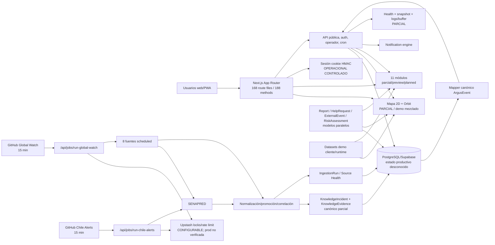
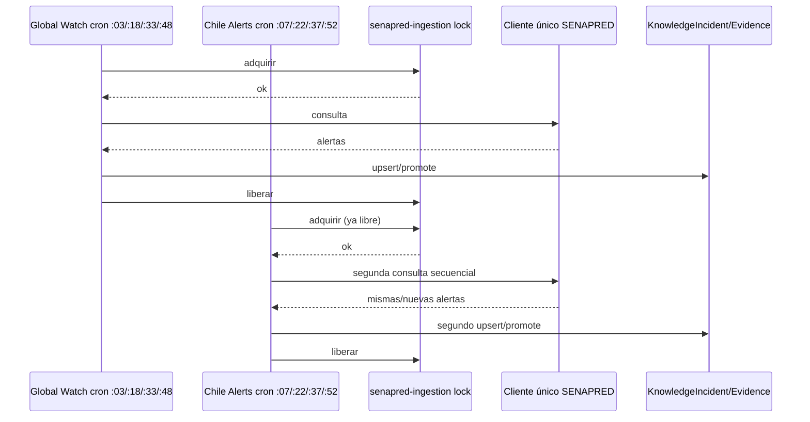
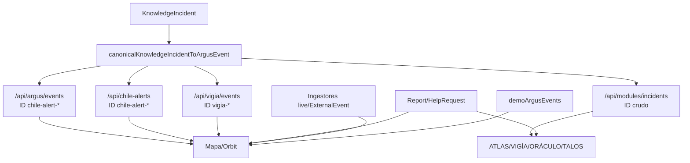

# ARGUS — mapa final del sistema

## Arquitectura ejecutable actual

## Flujo SENAPRED actual

El lock impide concurrencia pero no el doble propietario. El objetivo correcto es una consulta lógica por ventana y un consumidor secundario de persistencia/resultado.

## Superficies de incidente

## Clasificación de componentes

| Componente | Estado |
|---|---|
| Auth cookie HMAC/guards | operacional controlado local |
| Prisma schema/migrations | válido; despliegue remoto no verificado |
| Mapper/lifecycle | operacional controlado por tests |
| Global Watch | parcial |
| Chile Alerts | parcial |
| Source scheduler/health | parcial |
| Wildfire correlation | operacional controlado por tests |
| Mapa/Orbit | demo/preview bloqueante |
| Notification engine | operacional controlado local |
| Observabilidad | parcial |
| Backup/restore | no verificado |
| NEXUS | stub/planned |
| Command Center | demo deshabilitado |
| Adapters retirados | retired/legacy eliminado del árbol actual |
