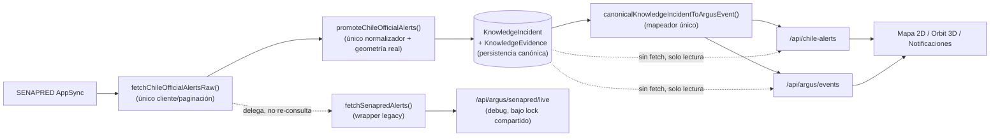

# ARGUS — Ingestión Canónica Única de SENAPRED

**Fecha**: 2026-07-14
**Tipo**: consolidación de arquitectura — elimina la duplicación de ingestión SENAPRED confirmada por la auditoría.
**Alcance**: no se modificó `prisma/schema.prisma`, no se crearon migraciones, no se eliminaron datos históricos, no se hizo commit ni push.

---

## 1. Arquitectura anterior

| Camino | Cliente | Adaptador | Destino | Job |
|---|---|---|---|---|
| A | `senapredGraphqlClient.ts` (propio `do/while` de paginación) | `senapredProvider.ts::fetchChileOfficialAlertsRaw` | `promoteChileOfficialAlerts` → `KnowledgeIncident` (geometría real vía `resolveAdministrativeAreaWithFallback`) | `/api/jobs/run-chile-alerts`, `/api/chile-alerts/run`, y la fuente `senapred_eventos` de Global Watch |
| B | `senapredGraphqlClient.ts` (SEGUNDO `do/while` de paginación, independiente) | `senapredEventosAdapter.ts::fetchSenapredAlerts` | `OfficialAlertSignal` con geometría de **solo punto-ancla** (`region_reference`, sin polígono real) — sin persistencia | `/api/argus/events` (mapa en vivo, cada request sin cache compartido con A), `/api/argus/senapred/live` (debug) |

Ambos caminos consultaban el **mismo backend AppSync** (`rz2uv7ifxbgflh2bqmp6kmh4le.appsync-api.us-east-1.amazonaws.com`) de forma completamente independiente — dos paginaciones completas, dos resoluciones de tablas de referencia, sin ninguna coordinación entre sí y sin el lock del Prompt 13 (que solo protegía el Camino A). El Camino B además usaba geometría estructuralmente más débil (un punto de ancla por región, nunca un polígono), violando la política de "nunca bbox/estimación como figura visible" del diseño canónico.

**Nota**: un tercer archivo, `src/lib/knowledge-intake/adapters/senapredAdapter.ts`, es un stub (`plannedAdapterResult`) sin implementación — no ejecuta ninguna consulta, se deja tal cual (cero riesgo, cero consumidor real).

## 2. Duplicación confirmada (reconocimiento)

| Componente | Consulta SENAPRED | Normaliza | Persiste | Proyecta | Programado |
|---|---:|---:|---:|---:|---:|
| `senapredProvider.ts` (`fetchChileOfficialAlertsRaw`) | Sí (única, tras esta tarea) | Sí (raw → `ChileOfficialAlertRaw`) | No (delega) | No | Sí — vía Chile Alerts |
| `alertPromotionEngine.ts` (`promoteChileOfficialAlerts`) | No | Sí (clasifica + geometría real) | Sí — `KnowledgeIncident`/`KnowledgeEvidence` | No | Sí |
| `senapredEventosAdapter.ts` (`fetchSenapredAlerts`) | No (delega, tras esta tarea) | Sí (a `OfficialAlertSignal`) | No | Sí (vía `correlateSignals`, solo para el debug endpoint) | No — bajo demanda |
| Global Watch (`runSenapredSource`) | No (delega) | — | — (delega en `promoteChileOfficialAlerts`) | — | Sí — cron 15 min |
| Chile Alerts (`runChileAlertsIngestion`) | No (delega) | — | — (delega en `promoteChileOfficialAlerts`) | — | Sí — cron 15 min |

## 3. Propietario elegido y arquitectura consolidada

**Propietario único programado: `/api/jobs/run-chile-alerts`** (Opción recomendada, §7), con `promoteChileOfficialAlerts` como único punto de persistencia real. Razones (confirmadas por el código, no supuestas):
- Ya tenía responsabilidad nacional explícita, geometría chilena real y lifecycle de alertas ya implementados.
- Global Watch **ya delegaba** en la misma función (`runSenapredSource` → `promoteChileOfficialAlerts`) desde antes de esta tarea — no había que migrarlo, solo confirmar que nunca ejecuta una segunda consulta independiente (nunca lo hizo) y protegerlo con el lock compartido (ya hecho en el Prompt 13).
- El verdadero segundo camino de consulta real era `senapredEventosAdapter.ts` (usado por `/api/argus/events`), no Global Watch — la auditoría original agrupó ambos bajo "Global Watch vs Chile Alerts", pero la inspección del código confirma que la duplicación real de red estaba entre el Camino A y el Camino B de la tabla de §1, ambos independientes del "propietario del job" en sí.

## 4. Cliente GraphQL único

`src/lib/adapters/senapred/senapredGraphqlClient.ts` — sin cambios de código, ya era el único cliente de bajo nivel (URL, operación GraphQL, headers firmados, timeout de 10s, validación de respuesta). Lo que se corrigió fue que **dos orquestadores distintos** llamaban a sus funciones (`fetchAlertasByDatePage`, `fetchSenapredReferenceTables`) en dos bucles de paginación independientes. Ahora solo `fetchChileOfficialAlertsRaw()` (`senapredProvider.ts`) ejecuta ese bucle; todo lo demás delega en ella.

## 5. Normalizador único

`fetchChileOfficialAlertsRaw()` produce `ChileOfficialAlertRaw[]` (crudo, sin clasificar). `promoteChileOfficialAlerts()` (`alertPromotionEngine.ts`) sigue siendo el único punto que clasifica severidad (`classifySeverityFromLevel`), dominio de amenaza (`classifyThreat`/`mapThreatToHazardDomain`) y resuelve geometría real (`resolveAdministrativeAreaWithFallback`) antes de persistir. `senapredEventosAdapter.ts::fetchSenapredAlerts()` reutiliza exactamente las mismas dos funciones de clasificación de severidad y de geometría — nunca reimplementa sus propias reglas — para su vista de solo lectura sin persistencia.

## 6. Persistencia canónica

Sin cambios respecto al diseño ya aprobado: `KnowledgeIncident` (evolución de facto del modelo canónico, Prompt 8) + `KnowledgeEvidence`, `upsert` por `externalId`. No se creó ni se propuso un segundo modelo de persistencia; `ArgusEvent` sigue siendo una proyección de lectura pura (nunca se persiste).

## 7. Identidad externa (`externalId`)

Sin cambios de regla (ya existente y correcta, confirmada por tests nuevos): `externalId = "{amenaza}:{slug(área)}:{fecha}"`, donde área = comuna ?? provincia ?? región, y fecha = solo la parte `YYYY-MM-DD` de `issuedAt`.

- **Actualización de la misma alerta** (SENAPRED republica el mismo día, misma área/amenaza): mismo `externalId` → `action: "updated"`, no un segundo incidente (Caso 2, testeado).
- **Cambio de nivel** (Amarilla → Roja el mismo día/área): mismo `externalId` — el nivel no forma parte de la clave — el incidente existente se actualiza con la nueva severidad (Caso 3, testeado).
- **Cancelación**: el texto de cancelación mueve `technicalFactors.lifecycle` a `"resolved"` y agrega el tag `lifecycle:cancelled` — el registro **no se elimina**, solo deja de aparecer en vistas activas vía la política de vigencia (Prompt 10). (Caso 4, testeado.)
- **Reapertura**: una evidencia nueva sobre el mismo `externalId` con lifecycle no terminal reactiva el incidente en la siguiente lectura (mecanismo ya existente de `operationalVisibilityPolicy.ts`, sin cambios).
- **Amenaza distinta o día distinto**: `externalId` distinto → nuevo incidente, correctamente (testeado).
- **Mismo evento en varias regiones**: cada región produce su propio `externalId` (una fila de `KnowledgeIncident` por región afectada) — esto es una decisión ya existente, no cambiada en esta tarea; documentado aquí porque la auditoría pedía explicitarlo.

## 8. Severidad

Sin cambios de regla: `classifySeverityFromLevel()` (`severeWeatherClassifier.ts`) sigue siendo la única función que traduce el nivel oficial SENAPRED a severidad ARGUS, usada tanto por `alertPromotionEngine.ts` (persistencia) como por `senapredEventosAdapter.ts` (vista legacy) — nunca dos reglas distintas. Un nivel no reconocido cae a `"medium"` (fallback seguro, nunca `"critical"` automático — Caso 9, testeado). El valor oficial (`levelText`) se preserva sin pérdida en `technicalFactors.levelText`.

## 9. Lifecycle

Sin cambios de política general (Prompt 10 sigue gobernando). Lo específico de SENAPRED (`chileAlertLifecycle()` en `alertPromotionEngine.ts`) no se tocó — se verificó con un test nuevo que la ruta de cancelación efectivamente marca `lifecycle: "resolved"` sin borrar el registro.

## 10. Geometría real

`resolveAdministrativeAreaWithFallback("CL", {commune, province, region})` es ahora el único resolutor de geometría usado por **ambos** caminos que hoy tocan datos reales de alertas (`alertPromotionEngine.ts` para persistencia, `senapredEventosAdapter.ts` para la vista legacy) — antes el Camino B usaba una tabla fija de 16 puntos-ancla (`REGION_ANCHOR_BY_CODIGO`), ahora retirada. Verificado con test explícito para **La Araucanía, Los Ríos y Los Lagos**: las tres resuelven un `MultiPolygon` real (nunca `region_reference` como resultado por defecto). Cuando no hay polígono resoluble para el nombre recibido, `senapredEventosAdapter.ts` **descarta la señal** en vez de mostrar un punto mal ubicado (mismo criterio de seguridad que ya tenía antes, ahora respaldado por el resolutor real en lugar de una tabla fija). `/api/chile-alerts`, `/api/vigia/events` (que excluye SENAPRED por diseño, ver §12) y `/api/argus/events` leen la misma fila persistida a través del mismo mapeador (`canonicalKnowledgeIncidentToArgusEvent`), así que producen exactamente la misma geometría (Caso 13, testeado).

## 11. `countryCode` y alcance territorial

Todas las alertas SENAPRED se etiquetan `country: "CL"` explícitamente en ambos caminos (nunca inferido por ausencia de dato). El alcance territorial se preserva como región/provincia/comuna explícitos — nunca se asume alcance nacional porque falte un campo (Caso 7/8, testeado).

## 12. Deduplicación

Sin cambios a la deduplicación general (fuera de alcance explícito, §16). La deduplicación efectiva sigue ocurriendo por `externalId` (identidad oficial + área + fecha), no por coordenadas. `/api/vigia/events` sigue excluyendo explícitamente `senapred_eventos` de su propia consulta (`VIGIA_SOURCE_IDS` filtra ese id) — decisión de diseño preexistente, no tocada, que evita que Chile aparezca dos veces (una vez en `/api/chile-alerts`, otra en `/api/vigia/events`). No se detectaron ni se intentó reconciliar duplicados **históricos** ya persistidos por ambos caminos anteriores — ver riesgos pendientes (§17).

## 13. Jobs y locks

El lock compartido `argus:job-lock:senapred-ingestion` (creado en el Prompt 13) ya envolvía `promoteChileOfficialAlerts()` en sus dos call sites (Global Watch y Chile Alerts). Esta tarea agrega un **tercer** punto de protección: `/api/argus/senapred/live` (el endpoint de debug que sigue llamando a `fetchSenapredAlerts()`, que a su vez llama a `fetchChileOfficialAlertsRaw()`) ahora también adquiere ese mismo lock antes de consultar — así ninguna de las tres rutas que pueden tocar AppSync puede ejecutar una consulta mientras otra ya está en curso.

`/api/argus/events` **ya no adquiere el lock** porque ya no consulta la red — lee `KnowledgeIncident` directamente, igual que `/api/chile-alerts`.

## 14. Source Health

`VIGIA_SOURCE_REGISTRY` ya tenía una única entrada `senapred_eventos` (no había un segundo registro duplicado); su campo `endpoint` ya documentaba `fetchChileOfficialAlertsRaw` como el mecanismo real. Se agregó el campo `managedByJob: "chile-alerts"` (nuevo, opcional) a `VigiaSourceDefinition`/`VigiaSourceHealth` para que el panel de Source Health pueda mostrar explícitamente qué job programado es responsable, sin ambigüedad entre "Global Watch lo consulta" y "Chile Alerts lo consulta" (ninguno de los dos hace una consulta propia — ambos delegan). El estado runtime (última corrida, error, alertas obtenidas) ya se calculaba correctamente de forma unificada porque ambos pipelines siempre escribieron al mismo `sourceId` en `KnowledgeIngestionRun`.

## 15. Endpoints de lectura

| Endpoint | Antes | Ahora |
|---|---|---|
| `/api/chile-alerts` | Lee `KnowledgeIncident` (canónico) | Sin cambios |
| `/api/vigia/events` | Excluye `senapred_eventos` explícitamente | Sin cambios |
| `/api/argus/events` | Live-fetch independiente (`fetchSenapredAlerts` + `correlateSignals`), cache propia de 5 min | Lee `KnowledgeIncident` (canónico), mismo mapeador (`idPrefix: "chile-alert"` — mismo `id` que `/api/chile-alerts` para la misma fila), sin cache propia, sin segunda consulta a SENAPRED |
| `/api/argus/senapred/live` | Live-fetch independiente sin lock | Live-fetch delegado (una sola consulta real) + lock compartido |

Corrección adicional en `/api/argus/events` (Prompt 14 §23): antes, una respuesta con cero señales activaba el fallback a `demoArgusEvents` (tratando "sin alertas" como si fuera un fallo) — ahora una lista vacía de `KnowledgeIncident` es un resultado válido (`source: "senapred_persisted"`, `events: []`) y el fallback demo solo se activa ante un error real de Prisma.

## 16. Notificaciones

Sin rediseño del motor (Prompt 11 sin tocar). Verificado con test nuevo: un `KnowledgeIncident` SENAPRED produce exactamente una notificación con `category: "official_alert"`, `verificationStatus: "official"`, `isOfficial: true` — la prevención de duplicados ya ocurre en la capa de persistencia (una fila por `externalId`), así que el motor de notificaciones, que lee filas ya deduplicadas, nunca ve el mismo incidente dos veces.

## 17. Código legacy

| Archivo | Estado anterior | Estado final | ¿Realiza fetch? |
|---|---|---|---|
| `senapredGraphqlClient.ts` | Cliente de bajo nivel, ya único | Sin cambios | Sí (el único punto real de red) |
| `senapredProvider.ts` (`fetchChileOfficialAlertsRaw`) | Orquestador de paginación #1 | Sin cambios — confirmado como el único orquestador | Sí (llama al cliente) |
| `alertPromotionEngine.ts` (`promoteChileOfficialAlerts`) | Normalizador + persistencia | Sin cambios | No (recibe alertas ya crudas) |
| `senapredEventosAdapter.ts` (`fetchSenapredAlerts`) | Orquestador de paginación #2 (independiente), geometría de solo punto-ancla | **Reescrito**: delega en `fetchChileOfficialAlertsRaw`, geometría real vía `resolveAdministrativeAreaWithFallback`, mismas reglas de severidad | No — delega, cero paginación propia |
| `senapredAdapter.ts` (`knowledge-intake/adapters`) | Stub sin implementar | Sin cambios (no ejecuta nada) | No |
| `/api/argus/events` | Consumía `fetchSenapredAlerts` en vivo | Lee `KnowledgeIncident` canónico | No |
| `/api/argus/senapred/live` | Consumía `fetchSenapredAlerts` sin lock | Sigue consumiéndolo (ahora delegado), bajo lock compartido | Sí (único, vía el wrapper) |

Nada se eliminó — cada archivo que antes ejecutaba una consulta independiente ahora delega en el único punto real de red, tal como exige el Prompt 14 §21 cuando no se puede demostrar ausencia total de consumidores.

## 18. Riesgos pendientes

- **Reconciliación de duplicados históricos**: si en producción ya existen filas de `KnowledgeIncident`/proyecciones divergentes generadas por los dos caminos antes de esta consolidación, no se tocaron ni se limpiaron (explícitamente fuera de alcance, §16/§21) — requiere una estrategia de reconciliación futura basada en `externalId`.
- **Cobertura comunal/provincial**: `resolveAdministrativeAreaWithFallback` depende de que el nombre de comuna/provincia exista en `chileComunas.json`/`chileProvincias.json` — cobertura parcial fuera de las regiones ya incluidas; una alerta con área no resoluble se descarta de la vista `fetchSenapredAlerts` en vez de mostrarse con geometría incorrecta (comportamiento seguro, pero significa "no visible" en ese caso puntual).
- **Cambios futuros de la API SENAPRED (AppSync)**: el esquema/URL están hardcodeados en `senapredGraphqlClient.ts`; un cambio de contrato de SENAPRED requeriría actualizar ese único archivo (ventaja directa de la consolidación) pero sigue siendo un punto de fragilidad externo no controlado por ARGUS.
- **Integración de otras fuentes oficiales chilenas** (DMC directo, ONEMI histórico, etc.): fuera de alcance de esta tarea; `dmcProvider.ts` sigue operando como extracción de menciones dentro del texto SENAPRED, no como fuente independiente.
