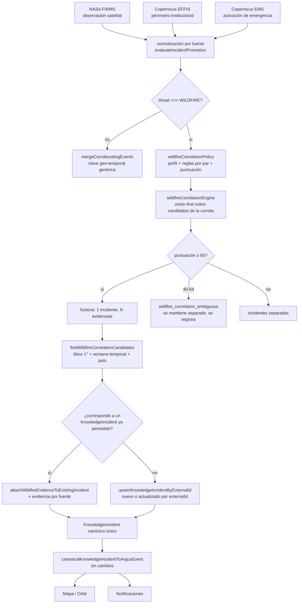

# ARGUS — Baseline de Correlación y Deduplicación de Incendios Forestales

**Fecha**: 2026-07-14
**Tipo**: especialización del sistema canónico de identidad/deduplicación (`docs/architecture/ARGUS_CANONICAL_INCIDENT_DESIGN.md` §7.2) para la amenaza `WILDFIRE`.
**Alcance**: no se modificó `prisma/schema.prisma`, no se crearon migraciones, no se agregaron fuentes nuevas, no se cambió el lifecycle general, la severidad general, el cron, SENAPRED, otros módulos, ni la UI. No se hizo commit ni push.

---

## 1. Problema que corrige

Antes de esta tarea, ARGUS no tenía una política específica de correlación para incendios. Un mismo incendio real podía representarse simultáneamente como:

- un cluster de hotspots NASA FIRMS (agrupados solo dentro de la misma corrida por `firmsClusterer.ts`, celda de 0.2° + día);
- un perímetro Copernicus EFFIS (`copernicus_effis`);
- una activación Copernicus EMS (`copernicus_ems`);
- y hasta tres `KnowledgeIncident` separados, tres conjuntos de evidencia, y potencialmente múltiples notificaciones.

La única defensa existente era `buildGlobalDedupKey()` (`src/lib/vigia/dedup.ts`): una clave `país:región:amenaza:coordenadas_redondeadas(0.25°):bucket_24h`, genérica para las 15 amenazas de Global Watch. Para incendios eso significa:

- **No usa geometría real** — un polígono EFFIS de 40 km de largo y un hotspot FIRMS a 12 km del borde pueden caer en buckets de coordenada distintos y no fusionarse aunque sean el mismo incendio; a la inversa, dos incendios distintos en la misma celda de 0.25° (~28 km) el mismo día se fusionarían por error.
- **No distingue observación de confirmación institucional** — FIRMS (satelital), EFFIS (perímetro oficial Copernicus) y EMS (activación de emergencia) se tratan igual que cualquier otra fuente.
- **Solo agrupa dentro de la misma corrida de Global Watch** (`mergeCorroboratingEvents`, en memoria, antes de persistir) — no correlaciona contra incidentes de incendio ya persistidos en corridas anteriores.

---

## 2. Fuentes (matriz)

| Fuente | Naturaleza | Geometría | Frecuencia | Identificador | Persistencia actual |
|---|---|---|---:|---|---|
| NASA FIRMS | Observación satelital térmica (VIIRS NOAA-21) | Point (cluster de focos, agrupados por `firmsClusterer.ts` en celdas de 0.2°) | Cada corrida de Global Watch (~15 min), `days=2` | `firms-cluster-{celda}-{día}` (cambia cada día — no es estable entre días) | `KnowledgeIncident` vía `upsertKnowledgeIncidentByExternalId` |
| Copernicus EFFIS | Área quemada / perímetro oficial Copernicus (Europa/Mediterráneo) | Polygon / MultiPolygon reales (WFS `modis.ba.poly`) | ~2 actualizaciones/día en el WFS, consultado cada corrida (`daysBack=7`) | `effis-{id/fid/objectid del WFS}` (estable entre corridas) | `KnowledgeIncident` |
| Copernicus EMS | Activación de mapeo de emergencia (Rapid Mapping) | Point (centroide WKT, sin polígono en el adaptador actual) | Consultado cada corrida (`daysBack=14`) | `copernicus-ems-{código EMSR}` (estable entre corridas) | `KnowledgeIncident` |

Para cada fuente:

| Fuente | ¿Observación? | ¿Incidente? | ¿Activación institucional? | Autoridad | Latencia | Resolución espacial | Confianza base (registry) |
|---|---|---|---|---|---|---|---|
| FIRMS | Sí (foco térmico) | Solo si el cluster es lo bastante denso (`evaluateIncidentPromotion`: ≥3 focos) | No | Alta como *dato* (NASA), baja como *confirmación de incendio* | Minutos-horas (pasada satelital) | ~375 m/pixel VIIRS, agrupado a ~22 km/celda | 80 |
| EFFIS | No (ya es perímetro) | Sí | No (es constatación de área quemada, no una activación de respuesta) | Alta (Copernicus institucional) | Horas | Polígono real, metros de precisión | 90 |
| EMS | No (es una solicitud/activación) | Sí, pero representa la activación, no necesariamente la primera observación del fuego | Alta (activación solicitada por un organismo autorizado) | Horas-días (posterior a la detección inicial) | Punto de evento/área solicitada, no un perímetro preciso | 91 |

---

## 3. Distinción fundamental (Prompt 15 §5)

```text
Hotspot satelital (FIRMS)  ≠  incendio confirmado
Incendio confirmado         ≠  perímetro oficial (EFFIS)
Perímetro oficial            ≠  activación de respuesta (EMS)
```

- **FIRMS** nunca se trata como confirmación institucional solo por venir de NASA — su rol es `satellite_observation`; eleva la correlación (y por tanto la confianza agregada del grupo) pero no sustituye la confirmación de una fuente institucional.
- **EFFIS** conserva su condición de perímetro/área quemada oficial (`institutional_perimeter`) — cuando correlaciona con un hotspot FIRMS, el grupo resultante usa EFFIS (o la fuente de mayor `sourceReliabilityScore`) como primaria, sin descartar la evidencia FIRMS.
- **EMS** conserva su condición de activación de emergencia (`emergency_activation`) — se vincula como evidencia/activación relacionada, nunca sustituye la observación primaria del fuego.

**Nota sobre "verificationStatus" (Prompt 15 §5, §17)**: el modelo de datos actual (`KnowledgeIncident`/`ArgusIncidentKnowledge`) no tiene un campo `verificationStatus` — ese campo es parte del diseño canónico futuro (`ARGUS_CANONICAL_INCIDENT_DESIGN.md` §10.2, Fase C, no implementada todavía). Esta tarea no lo introduce (prohibido cambiar el modelo lógico general). El principio "FIRMS solo no confirma oficialmente" se aplica hoy de dos formas verificables: (1) `wildfireSourceRole()` nunca trata `nasa_firms` como `institutional_perimeter`/`emergency_activation`; (2) en `correlateWildfireEvents`/`attachWildfireEvidenceToExistingIncident`, la fuente con mayor `sourceReliabilityScore` (EFFIS 90 / EMS 91 sobre FIRMS 80) siempre gana como primaria cuando hay correlación, así que un grupo con una fuente institucional nunca queda "liderado" por FIRMS. Un grupo compuesto solo por FIRMS nunca se escala más allá de la severidad que sus propios miembros ya traían (Caso 12, verificado en test).

---

## 4. Arquitectura

### 4.1 Antes

```text
FIRMS (por corrida) ──┐
EFFIS (por corrida) ──┼─→ evaluateIncidentPromotion (por evento) ─┐
EMS (por corrida)   ──┘                                            │
                                                                     ▼
                                    mergeCorroboratingEvents (buildGlobalDedupKey genérico)
                                                                     │
                                                                     ▼
                                         upsertKnowledgeIncidentByExternalId (por evento fusionado)
                                                                     │
                                                                     ▼
                                    hasta 3 KnowledgeIncident / hasta 3 notificaciones
```

### 4.2 Ahora



No quedó una arquitectura paralela: `wildfireCorrelationPolicy`/`wildfireCorrelationEngine` son una especialización que sustituye únicamente el paso de agrupamiento (`mergeCorroboratingEvents`) para eventos `WILDFIRE`; el resto del pipeline (promoción, persistencia, mapeador canónico, notificaciones, lifecycle sweep) es exactamente el mismo código no tocado para las demás 14 amenazas.

---

## 5. Perfil de correlación (`src/lib/vigia/wildfireCorrelationPolicy.ts`)

```ts
type WildfireCorrelationProfile = {
  temporalWindowHours: number;      // 96h — techo por defecto para pares sin regla específica
  pointDistanceKm: number;          // 20km — punto a punto por defecto
  clusterDistanceKm: number;        // 25km — continuidad entre clusters FIRMS consecutivos
  polygonOverlapThreshold: number;  // 0.1 — reservado para un segundo productor de polígonos futuro
  centroidDistanceKm: number;       // 20km — fallback centroide-centroide sin polígono
  regionConstraint: boolean;        // true
  countryConstraint: boolean;       // true — bloqueo duro, ver §8
};
```

### 5.1 Reglas por par de fuentes

| Par de fuentes | Señales usadas | Umbral | Resultado posible |
|---|---|---|---|
| FIRMS ↔ FIRMS | Distancia centroide-centroide, ventana temporal | ≤25 km, ≤72 h | Fusiona (mismo frente); >25km o >72h → separado |
| FIRMS ↔ EFFIS | Contención en polígono (prioritaria) o distancia al borde | Contenido = máximo; si no, ≤10 km, ≤120 h | Fusiona (EFFIS confirma, FIRMS queda como evidencia); fuera de tolerancia → separado |
| FIRMS ↔ EMS | Distancia centroide-centroide | ≤30 km, ≤168 h (7 días) | Fusiona dentro del radio operacional; una activación amplia NO absorbe hotspots fuera de ese radio |
| EFFIS ↔ EMS | Contención en polígono o distancia al borde | Contenido = máximo; si no, ≤25 km, ≤240 h (10 días) | Fusiona; activación asociada al mismo perímetro |
| Cualquier otra fuente clasificada WILDFIRE (GDACS, EONET, ReliefWeb, SENAPRED, prensa) | Distancia centroide-centroide | ≤20 km, ≤96 h (regla genérica conservadora, `sourceRelationScore` más bajo) | Fusiona solo si realmente cercana en tiempo/espacio |

Cada valor está justificado en el docstring del archivo contra el comportamiento real ya observado en los adaptadores (tamaño de celda de `firmsClusterer.ts`, cadencia de actualización EFFIS, naturaleza de una activación EMS) — no son valores arbitrarios.

### 5.2 Puntuación determinista (0-100)

```text
spatial (0-40)        — contención de polígono = 40; si no, decae linealmente hasta 0 en el maxDistanceKm del par
temporal (0-25)       — decae linealmente hasta 0 en el maxTemporalHours del par
administrative (0-15) — mismo país+región = 15; mismo país, región desconocida = 8; datos insuficientes = 4; país distinto = 0 (inalcanzable: el gate duro ya separó antes)
sourceRelation (0-15) — par catalogado explícitamente (FIRMS/EFFIS/EMS) = 15; otro par = 8
semantic (0-5)        — ambos clasificados WILDFIRE = 5 (siempre, si se llegó a puntuar)
```

Umbrales: `WILDFIRE_MERGE_THRESHOLD = 65` (fusiona), `WILDFIRE_CANDIDATE_THRESHOLD = 40` (relación candidata ambigua, se registra vía `wildfire_correlation_ambiguous`, se mantiene separado), por debajo de 40 → separado sin registro adicional.

### 5.3 Gates duros (antes de puntuar, en este orden)

1. Ambos lados deben estar clasificados `WILDFIRE` (`classifyGlobalThreat`).
2. Ninguno de los dos lados puede estar en un lifecycle terminal (`resolved/archived/rejected/duplicate`) — reutiliza el mismo vocabulario que `classifyLifecycleVisibility` (`operationalVisibilityPolicy.ts`, Prompt 10), sin reinventar lifecycle.
3. Ambas coordenadas deben ser finitas y válidas.
4. Si ambos países son conocidos y distintos → separado (bloqueo duro, ver §8).
5. Distancia/contención dentro del `maxDistanceKm` del par.
6. Diferencia temporal dentro del `maxTemporalHours` del par.

Solo si las seis pasan se calcula la puntuación ponderada.

---

## 6. Geometría (`src/lib/geometry/wildfireGeometry.ts`)

- **Point / Polygon / MultiPolygon**: soportados directamente sobre el formato GeoJSON crudo que ya producen los adaptadores (`{type, coordinates}`, sin transformación).
- **Centroide**: promedio aritmético de vértices (mismo método que ya usaba `effisAdapter.ts` para su propio centroide — reutilizado, no reinventado).
- **Punto-en-polígono**: ray-casting sobre el anillo exterior únicamente (los huecos de un polígono no se restan — limitación documentada, aceptable porque las áreas quemadas EFFIS son formas exteriores simples en la práctica, y un falso "adentro" en el borde de un hueco solo puede subir el puntaje, nunca perder evidencia real silenciosamente).
- **Distancia punto-a-borde de polígono**: distancia mínima a cada segmento del anillo, con una proyección local equirrectangular (adecuada a la escala de un incendio, nunca cientos de km).
- **Bounding box**: usado **exclusivamente como preselección** (`findWildfireCorrelationCandidates`, margen de 1° ~110 km) — la decisión final siempre la toma la distancia/contención real calculada sobre la geometría, nunca el bbox (Prompt 15 §10, verificado: ningún `if` de decisión final compara bboxes).
- Sin dependencia nueva: el único paquete geoespacial ya presente en el repo es `leaflet` (renderizado, no análisis) — no se justificaba agregar `turf` u otra librería para esta escala de cálculo.

---

## 7. Identidad canónica

```text
KnowledgeIncident.id            → identidad interna estable (cuid), nunca cambia dentro de esta tarea.
KnowledgeIncident.externalId    → preservado por fuente primaria (FIRMS: celda+día; EFFIS: id/fid WFS; EMS: código EMSR).
Evidencia (KnowledgeEvidence)   → una fila por (incidentId, sourceId) vía saveKnowledgeEvidenceIfNew — cada fuente conserva su propio rawRef/sourceId, nunca se sobreescribe entre sí.
```

- Cada fuente conserva su propio `externalId` como `sourceId` de la evidencia adjunta — la fusión de correlación de incendios **no** reemplaza ni descarta el identificador de ninguna fuente, solo decide a qué `KnowledgeIncident.id` se adjunta cada una.
- La identidad del incidente canónico **no cambia** cuando llega una nueva observación FIRMS, EFFIS publica un perímetro actualizado (mismo `externalId` de WFS → mismo `[sourceId, externalId]` → `upsertKnowledgeIncidentByExternalId` actualiza la misma fila, comportamiento preexistente sin cambios) o EMS activa cartografía sobre el mismo incendio (se adjunta como evidencia vía `attachWildfireEvidenceToExistingIncident`, que nunca crea una fila nueva).
- No se usan coordenadas redondeadas como identidad permanente — la clave de correlación (`evaluateWildfireCorrelation`) es una decisión de puntuación evaluada en cada corrida, no una clave persistida; la identidad persistida sigue siendo `KnowledgeIncident.id`/`[sourceId, externalId]`, exactamente como aprobó el diseño canónico (`ARGUS_CANONICAL_INCIDENT_DESIGN.md` §7.1).

---

## 8. Prevención de falsas fusiones

No se fusiona únicamente por compartir país, región, día, categoría `wildfire` o bbox amplio:

- **País distinto conocido → bloqueo duro** (`country_mismatch`), incluso si la distancia sería pequeña — simplificación documentada para incendios transfronterizos (ver Riesgos, §13): una fusión real cruzando frontera con continuidad geométrica genuina requeriría una polígono que efectivamente cruce el límite, caso no cubierto en esta fase.
- **Dos incendios en la misma región y día pero sin continuidad geométrica ni temporal** quedan separados (verificado: test "Caso 5", "Caso 6b").
- **Una activación EMS territorial amplia no absorbe todos los hotspots de la región** — el radio de 30 km (FIRMS↔EMS) es un límite operacional, no "todo el país" (verificado: test "Caso 8").
- **Continuidad transitiva, no distancia directa**: dos observaciones FIRMS a ~40 km en línea recta se fusionan solo si existe una cadena de clusters intermedios separados ≤25 km entre sí (unión-find); sin esa cadena, quedan separadas aunque la "coincidencia de categoría" sea idéntica (verificado: test "Caso 6a" vs "Caso 6b" — la distancia sola nunca decide).
- **Relación candidata ambigua** (puntuación 40-64): se registra (`wildfire_correlation_ambiguous`) pero se mantiene separado — el modelo actual no tiene una tabla de relaciones dedicada (`IncidentRelation` es parte del diseño canónico futuro, no implementada), así que "registrar la relación candidata" se cumple vía el log estructurado, no vía persistencia; esto está documentado como limitación en §13.

---

## 9. Lifecycle

La correlación reutiliza el vocabulario ya existente (`technicalFactorsJson.lifecycle`) sin rediseñarlo:

- Un incidente en lifecycle terminal (`resolved`, `archived`, `rejected`, `duplicate`) **nunca** se usa como destino de una fusión automática — gate duro en `evaluateWildfireCorrelation` (razón `terminal_lifecycle_requires_reopening`).
- La reapertura sigue las reglas ya aprobadas del Prompt 8/10 (transición explícita) — esta tarea no inventa una reapertura automática por correlación.
- `findWildfireCorrelationCandidates` no filtra por lifecycle en la query SQL (evitaría tener que interpretar JSON en Prisma, ver limitación conocida ya documentada en `ARGUS_OPERATIONAL_LIFECYCLE_POLICY.md` §7) — el filtro de lifecycle terminal se aplica en memoria, dentro de `evaluateWildfireCorrelation`, sobre cada candidato preseleccionado.

---

## 10. Severidad y confianza

- **`sourceSeverity` nunca se pierde**: cada fuente aporta su propia severidad (`severityForFirmsCluster`, `severityFromBurnedArea`, `severityForActivation`) sin cambios — esta tarea no tocó ninguno de los tres clasificadores.
- **La severidad efectiva del grupo fusionado** = `maxSeverity` de todos los miembros (mismo criterio que `mergeCorroboratingEvents` ya usaba para el resto de las amenazas — reutilizado, no reinventado).
- **FIRMS por sí solo no escala a `critical`**: dos clusters FIRMS de severidad `high` fusionados entre sí permanecen en `high`, nunca suben a `critical` solo por la fusión (verificado: test "Caso 12").
- **La confianza sube con corroboración multi-fuente**: `+8` por cada fuente adicional agrupada, tope 98 — misma fórmula que `mergeCorroboratingEvents`.
- **Una fuente oficial eleva el outcome sin borrar evidencia secundaria**: si el grupo fusionado incluye una fuente `isOfficial` (EFFIS/EMS lo son en el registry) y el outcome primario era `candidate`, se promueve a `incident` — pero FIRMS permanece en `sourceIds`/evidencia (verificado: test "Caso 9/13").

---

## 11. Rendimiento

- **Dentro de una corrida**: `correlateWildfireEvents` compara pares O(n²) sobre el subconjunto WILDFIRE de una sola corrida — n está acotado aguas arriba (FIRMS ya limita a 100 clusters/corrida, EFFIS/EMS limitan por `limit`/filtros de fecha-área), nunca se compara contra el historial completo.
- **Cross-corrida**: `findWildfireCorrelationCandidates` preselecciona con `domain=wildfire`, ventana temporal (`updatedAt >= now - 3×temporalWindowHours`), bbox de 1° (~110 km) y `take` acotado (20-50 filas) — nunca carga todos los incendios persistidos en memoria (Prompt 15 §23).
- El bbox de preselección es deliberadamente más generoso que cualquier `maxDistanceKm` de par (máximo 30 km) — es solo un filtro rápido; la decisión final la toma `evaluateWildfireCorrelation` con distancia/contención real sobre cada candidato devuelto.

---

## 12. Notificaciones y mapa

- **Dentro de una corrida**: un grupo de N fuentes fusionadas produce **un solo** `PromotedEvent` → una sola llamada a `upsertKnowledgeIncidentByExternalId` → como mucho una notificación, no N (verificado: test de integración, `upsertMock` llamado exactamente 1 vez para 3 fuentes).
- **`generatesNotification`** del grupo fusionado = `true` solo si la fuente primaria ya notificaba, o si la severidad combinada **realmente subió** respecto a la severidad original de la primaria — adjuntar más evidencia del mismo incendio sin cambio material de severidad no vuelve a notificar (Prompt 15 §20).
- **Cross-corrida**: cuando una nueva señal se adjunta a un incidente ya persistido (`attachWildfireEvidenceToExistingIncident`), solo cuenta como generadora de notificación si además elevó la severidad persistida (`attachResult.severityRaised`) — una nueva observación FIRMS sin cambio material sobre un incendio ya conocido no dispara otra alerta.
- **Mapa**: como el pipeline sigue produciendo un único `KnowledgeIncident` por incendio correlacionado, el mapeador canónico ya existente (`canonicalKnowledgeIncidentToArgusEvent`, sin cambios) sigue proyectando exactamente un `ArgusEvent` por fila — no se tocó el mapeador ni se creó una capa técnica nueva (fuera de alcance, Prompt 15 §21).

---

## 13. Limitaciones y riesgos pendientes

- **Incendios transfronterizos**: el bloqueo duro por país distinto (§8) es una simplificación deliberada — un incendio real que cruza una frontera con continuidad geométrica genuina no se fusionará hoy. Corregirlo requeriría relajar el gate de país cuando existe contención poligonal directa entre ambos lados, evaluado con cuidado para no reabrir el riesgo de fusión falsa transfronteriza — queda como trabajo futuro, no implementado aquí.
- **División automática de incendios**: no se implementó (no era obligatorio, Prompt 15 §15) — un incendio que se divide en dos frentes reales seguirá representado como un único `KnowledgeIncident` mientras la correlación siga cumpliendo el perfil. La identidad no es tan rígida como para impedirla en el futuro (no hay una clave persistida basada en coordenadas fijas), pero la lógica de división no está implementada.
- **Relación candidata ambigua no persistida**: el rango de puntuación 40-64 se registra solo como log estructurado (`wildfire_correlation_ambiguous`), no como fila persistida — el modelo actual no tiene una tabla `IncidentRelation` (parte del diseño canónico futuro, Fase C). Cuando esa tabla exista, este es el punto de integración natural.
- **EMS sin polígono real**: el adaptador actual de Copernicus EMS solo expone un centroide WKT, no el polígono de la activación — el radio de 30 km (FIRMS↔EMS) y 25 km (EFFIS↔EMS) son aproximaciones operacionales, no geometría real de la activación. Si el adaptador EMS incorporara el polígono real de la activación (fuera de alcance de esta tarea: "no agregar fuentes nuevas", pero sí aplicaría a exponer más campos del mismo EMS), la regla podría usar contención real en vez de un radio fijo.
- **Reconciliación histórica**: no se ejecutó ninguna limpieza de datos existentes (prohibido en esta tarea). Ver propuesta en §14.
- **Calibración futura de umbrales**: los valores de `WILDFIRE_PAIR_RULES` están calibrados contra el comportamiento documentado de los adaptadores, no contra un conjunto de incendios reales etiquetados — quedan como candidatos a ajuste fino cuando exista un conjunto de validación histórico.
- **Incorporación futura de CONAF**: si Chile agrega una fuente CONAF de incendios forestales (fuera de alcance de esta tarea — "no agregar fuentes nuevas"), debería declararse como un nuevo `WildfireSourceRole` (probablemente `institutional_perimeter` o un rol propio `national_authority`) con su propia entrada en `WILDFIRE_PAIR_RULES`, siguiendo el mismo patrón que EFFIS/EMS — la política ya está diseñada para extenderse sin reescribir la lógica de scoring.

---

## 14. Propuesta de reconciliación histórica (no ejecutada)

**No se ejecutó ningún script de reconciliación ni limpieza sobre datos existentes** — solo se documenta la propuesta, tal como exige el Prompt 15 §22.

### Patrones de duplicación esperables en datos históricos

1. **FIRMS multi-día del mismo incendio**: antes de esta tarea, cada corrida generaba un `externalId` distinto por día (`firms-cluster-{celda}-{día}`) — un incendio de una semana pudo haber creado hasta 7 `KnowledgeIncident` FIRMS distintos, sin fusionar entre sí.
2. **FIRMS + EFFIS + EMS del mismo incendio, ya persistidos como filas separadas**: cualquier incendio activo antes de esta tarea con cobertura de más de una fuente.

### Campos que permitirían reconciliarlos

- `domain = "wildfire"`, `country`, `latitude`/`longitude` (o `geometryJson` cuando exista), `occurredAt`/`detectedAt`, `sourceId`.
- El mismo `evaluateWildfireCorrelation()` de esta tarea podría aplicarse par a par sobre el histórico persistido (ya es una función pura, reutilizable fuera del pipeline en vivo).

### Riesgos de una fusión histórica

- **Pérdida de trazabilidad si se fusiona incorrectamente**: a diferencia de la corrida en vivo (que decide con datos frescos y ventanas ajustadas), un incendio histórico con datos incompletos (coordenadas ausentes, fechas mal parseadas) tiene más probabilidad de gates duros fallando silenciosamente hacia "separado" — subestimar duplicados es más seguro que sobreestimarlos, pero implica que la reconciliación histórica requeriría revisión manual de los casos "candidato" (40-64 puntos), no solo aplicar el umbral de fusión automática.
- **Notificaciones ya enviadas**: fusionar incidentes históricos no debe re-disparar notificaciones — cualquier script futuro debe operar exclusivamente sobre `KnowledgeIncident`/`KnowledgeEvidence`, nunca sobre el sistema de notificaciones ya entregadas.
- **Volumen**: sin una tabla de índice espacial, un backfill completo requeriría el mismo patrón de preselección por bbox+ventana que `findWildfireCorrelationCandidates`, corrido en lotes, no una sola consulta.

**Recomendación**: implementar como script offline (`scripts/reconcileHistoricalWildfires.ts`, no creado en esta tarea), ejecutado manualmente contra un snapshot o en horario de bajo tráfico, con modo `--dry-run` obligatorio por defecto y revisión humana de los casos de puntuación 40-64 antes de cualquier fusión real.

---

## 15. Archivos de esta tarea

**Nuevos**:
- `src/lib/geometry/wildfireGeometry.ts` — primitivas geoespaciales puras.
- `src/lib/vigia/wildfireCorrelationPolicy.ts` — perfil, reglas por par, puntuación determinista.
- `src/lib/vigia/wildfireCorrelationEngine.ts` — agrupamiento (unión-find) y fusión de una corrida.
- `tests/vigia/wildfireGeometry.test.ts`
- `tests/vigia/wildfireCorrelationPolicy.test.ts` — 20 casos obligatorios (Prompt 15 §26).
- `tests/vigia/wildfireCorrelationEngine.integration.test.ts` — integración ligera (Prompt 15 §27).
- `docs/operations/ARGUS_WILDFIRE_CORRELATION_BASELINE.md` — este documento.

**Modificados**:
- `src/lib/vigia/globalWatchEngine.ts` — separa eventos WILDFIRE para usar `correlateWildfireEvents` en vez de `mergeCorroboratingEvents`; agrega correlación cross-corrida contra incidentes persistidos antes del upsert por externalId.
- `src/lib/knowledge-intake/persistence/knowledgePersistenceService.ts` — agrega `findWildfireCorrelationCandidates` (preselección acotada) y `attachWildfireEvidenceToExistingIncident` (adjunta evidencia sin crear fila nueva).

Ningún otro archivo productivo fue tocado. No se modificó `prisma/schema.prisma`, no hay migraciones, no se modificaron adaptadores (FIRMS/EFFIS/EMS se consultan igual, solo se reutilizan sus campos ya existentes), no se cambió el cron, SENAPRED, otros módulos, la UI, la versión ni el changelog.
